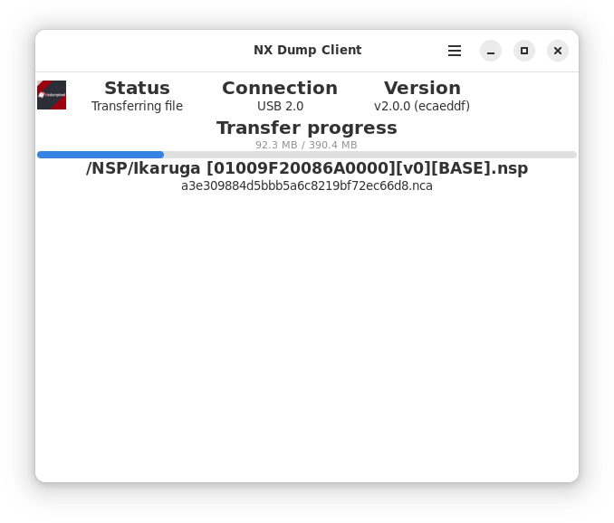

# NX Dump Client

## A client for dumping over USB with [nxdumptool](https://github.com/DarkMatterCore/nxdumptool)


[](https://aur.archlinux.org/packages/nxdumpclient)
[](https://aur.archlinux.org/packages/nxdumpclient-git)

[](https://flathub.org/apps/org.v1993.NXDumpClient)



Not much to say, really - it just works! You can enable autostart in settings and leave it running in background if you so desire.

### Official nxdumptool discord server where I and other helpful people can be found: https://discord.gg/SCbbcQx

## Frequently asked questions

### What is the preferred installation method?

Short version: AUR (stable) package if you're on Arch-based distro, flatpak from Flathub otherwise. Installing flatpaks attached to releases is generally discouraged (these are provided for the sake of completeness) - please install from Flathub if possible instead.

Long version: Manual building or using unofficial packages may be viable options in non-Arch environments, but Manjaro/GNOME's Flatpak SDK (whichever is less up-to-date at the moment) is what ultimately determines what is the highest library version features from which I'll consider using. While I'm willing to support more distros natively, I won't be going out of my way to do so (a few tweaks to build system are fine, having to manually implement a feature present in newer version of a library/tool is not).

### Where are the dumps stored?

By default in your Downloads folder. You can change path (and a couple of other handy settings) in preferences.

### NSP/NCA dumps always abort with checksum error

Additional verification is implemented compared to official `nxdt_host.py` program for those file types. An unfortunate side effect of this is that dumping with most non-default options will lead to checksum failure (since it modifies file contents but not initial checksum).

You can either dump with default settings (which you probably should be doing anyways) or disable additional verification in preferences.

A slightly different method that accounts for non-standard dump settings exists; I intend to add it later on.

### I get permissions error. Why?

Installing special udev rules is required for user access to device. You should have been prompted to do so interactively on first launch if using flatpak; system-wide installation installs rules automatically. Please report an issue if you think udev rules should have been installed by now - make sure to mention installation method in your report.

### Why does flatpak version require network access, anyways?

Because of how udev events are communicated on Linux. You can manually revoke it if you so desire, but that will break support for device hotplug - i.e. you'll have to always connect your switch before starting the program.

## Building

```bash
git clone https://github.com/v1993/nxdumpclient.git
cd nxdumpclient
meson setup --buildtype=debugoptimized -Db_lto=true -Denforce_build_order=true --prefix=/usr build
meson compile -C build
meson install -C build
```

Please note that a fairly recent distro is required - see dependencies section below.

An alternative to direct installation is to use flatpak manifest stored at `flatpak/org.v1993.NXDumpClient.yml` (please note that building with flatpak requires initializing git submodules; they are not used otherwise). Use of `flatpak-builder` is out-of-scope for this document - download pre-built package from Flathub if you just want to use the flatpak version.

### Updating

```bash
cd nxdumpclient
git pull
meson subprojects update
meson compile -C build
meson install -C build
```

Note for those using `flatpak-builder`: you'll want to update git submodules as well, but can skip updating meson subprojects.

### Dependencies

* GTK >= 4.10
* libadwaita >= 1.4
* GLib >= 2.76
* GUsb (reasonably new)
* libportal (optional for non-sandbox builds)
* blueprint-compiler >= 0.10 (build-only; automatically fetched by meson if not available)
